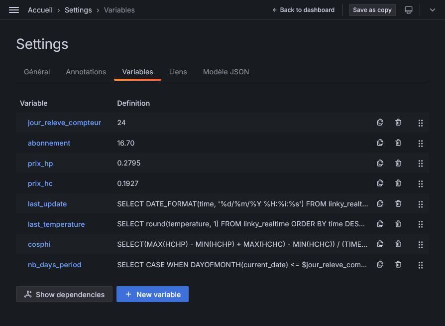

# linkystat [](https://github.com/rsaikali/linkystat/actions/workflows/github-code-scanning/codeql) [](https://github.com/rsaikali/linkystat/actions/workflows/main.yml)

Monitoring for Linky device (French electricity meter) through Grafana


## Hardware Requirements

<table>
  <tr>
    <td valign="center"></td>
    <td valign="center"></td>
    <td valign="center"></td>
  </tr>
 </table>

- RaspberryPi (or any other computer that can stand 24/7 next to your Linky electricity meter :wink:)

- [Micro Teleinfo V3.0](https://www.tindie.com/products/hallard/micro-teleinfo-v30/) dongle. It is plugged in the RaspberryPi through USB port and connected to the Teleinfo Linky pins.
The USB dongle is available on [Tindie](https://www.tindie.com/products/hallard/micro-teleinfo-v30/).
- [Linky](https://particulier.edf.fr/en/home/contract-and-consumption/meter/linky-meter.html) electricity meter.

## Software Requirements

- Docker
- Docker Compose

## Installation

```bash
# Clone the repository
git clone https://github.com/rsaikali/linkystat.git

# Change directory
cd linkystat
```

### Configuration file

```bash
# Copy the example environment file
cp env/.env.example .env

# Edit the environment file (see next section for details)
nano .env
```

| Name | Description | Default value |
| ---- | ----------- | :-------------: |
| `LINKY_USB_DEVICE` | Micro Teleinfo USB port | `/dev/ttyACM0` |
| `OPENWEATHER_API_KEY` | OpenWeather API key | |
| `OPENWEATHER_LATITUDE` | Latitude used by OpenWeather | |
| `OPENWEATHER_LONGITUDE` | Longitude used by OpenWeather | |
| `MYSQL_ROOT_PASSWORD` | MySQL root password | `root_password` |
| `MYSQL_DATABASE` | MySQL Linkystat database | `linky` |
| `MYSQL_USER` | MySQL Linkystat user | `linky` |
| `MYSQL_PASSWORD` | MySQL Linkystat password | `linky` |
| `GRAFANA_MYSQL_USER` | MySQL Grafana user | `grafana` |
| `GRAFANA_MYSQL_PASSWORD` | MySQL Grafana password | `grafana` |
| `GF_SECURITY_ADMIN_USER` | Grafana admin user | `admin` |
| `GF_SECURITY_ADMIN_PASSWORD` | Grafana admin password | `admin` |
| `GF_SECURITY_ADMIN_EMAIL` | Grafana admin email | |

**Note**: Grafana will be exposed on port 3000. You should configure an external reverse proxy (Traefik, Caddy, nginx, etc.) to handle HTTPS and domain routing.

```bash
# Build and start the containers
docker compose --env-file ./.env up -d

# Open Grafana in your browser
http://<raspberry_ip_address>:3000
```

### Docker

Launch `docker compose` using the previously edited `.env` file.

```bash
# Build and start the containers
docker compose --env-file ./.env up -d
```

### Configuration in Grafana

Open Grafana in your browser: `http://<raspberry_ip_address>:3000` and login with the previously created admin user:


Then go to `Settings`>`Variables` to setup personalized variables for your installation:



Here you have to setup the first four variables (keep the others to their default values):

| Name | Description |
| ---- | ----------- |
| `jour_releve_compteur` | Day of provider meter reading |
| `abonnement` | Subscription price |
| `prix_hp` | Peak hours kWh price |
| `prix_hc` | Off-peak hours kWh price |

You can now enjoy your Linkystat Grafana dashboard!

## License

[MIT](./LICENSE)
