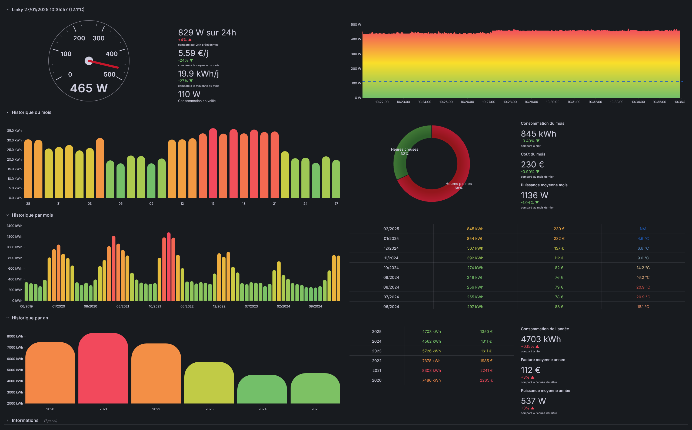
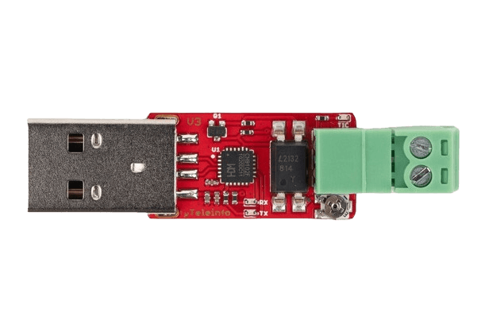

# linkystat [](https://github.com/rsaikali/linkystat/actions/workflows/github-code-scanning/codeql) [](https://github.com/rsaikali/linkystat/actions/workflows/main.yml)

Monitoring for Linky device (French electricity meter) through Grafana




## Hardware Requirements

<table>
  <tr>
    <td valign="center"></td>
    <td valign="center"></td>
    <td valign="center"></td>
  </tr>
 </table>

- RaspberryPi (or any other computer that can stand 24/7 next to your Linky electricity meter :wink:)

- [Micro Teleinfo V3.0](https://www.tindie.com/products/hallard/micro-teleinfo-v30/) dongle. It is plugged in the RaspberryPi through USB port and connected to the Teleinfo Linky pins.
The USB dongle is available on [Tindie](https://www.tindie.com/products/hallard/micro-teleinfo-v30/).
- [Linky](https://particulier.edf.fr/en/home/contract-and-consumption/meter/linky-meter.html) electricity meter.

## Software Requirements

- Docker
- Docker Compose

## Installation

```bash
# Clone the repository
git clone https://github.com/rsaikali/linkystat.git

# Change directory
cd linkystat

# Copy the example environment file
cp env/.env.example .env

# Edit the environment file (see next section for details)
nano .env

# Build and start the containers
docker compose --env-file ./.env up -d
# or if you want to use HTTPS with your domain name and LetsEncrypt certificates (need to be configured through .env file)
docker compose --env-file ./.env -f compose.yaml -f compose.prod.yaml --profile https up -d

# Open Grafana in your browser
http://<raspberry_ip_address>:3000
# or if you use HTTPS with a domain name
https://<your_domain_name>
```

## Configuration

### Environment file

| Name | Description | Default value |
| ---- | ----------- | :-------------: |
| `LINKY_USB_DEVICE` | Micro Teleinfo USB port | `/dev/ttyACM0` |
| `DAYS_OFFSET` | Provider calculation offset in days (for example, set to `19` if your provider month range is from 20th of current month to 19th of next month) | `0` |
| `MYSQL_ROOT_PASSWORD` | MySQL root password | `root_password` |
| `MYSQL_DATABASE` | MySQL Linkystat database | `linky` |
| `MYSQL_USER` | MySQL Linkystat user | `linky` |
| `MYSQL_PASSWORD` | MySQL Linkystat password | `linky` |
| `GRAFANA_MYSQL_USER` | MySQL Grafana user | `grafana` |
| `GRAFANA_MYSQL_PASSWORD` | MySQL Grafana password | `grafana` |
| `GF_SECURITY_ADMIN_USER` | Grafana admin user | `admin` |
| `GF_SECURITY_ADMIN_PASSWORD` | Grafana admin password | `admin` |
| `GF_SECURITY_ADMIN_EMAIL` | Grafana admin email | |

If used with domain name/HTTPS, LetsEncrypt certificates will be automatically generated. 
Keep variables empty to use in a simple environment (Grafana will be available only on your local network).

| Name | Description |
| ---- | ----------- |
| `VIRTUAL_HOST` | Domain name used for exposed application |
| `VIRTUAL_PORT` | Port used for exposed application |
| `LETSENCRYPT_HOST` | LetsEncrypt domain name (should be identical to `VIRTUAL_HOST`) |
| `LETSENCRYPT_EMAIL` | LetsEncrypt email used for certificate generation |

## License

[MIT](./LICENSE)
